# Hi There! 👋

I'm a self-taught software & DevOps engineer with a passion for producing high quality solutions to real-world problems. I pick up new languages and ecosystems quickly and have recently been developing the [Jumpy] game and the [Bones] game engine!

[jumpy]: https://github.com/fishfolk/jumpy
[bones]: https://github.com/fishfolk/bones

I'm the Chief Technology Lead at [Katharos Technology](https://katharostech.com), where we try to devevelop technology that is pure and uplifting. The most important thing in my life is my God and Father to whom I owe everything.

I also have a [blog](https://zicklag.github.io/blog) where I write about stuff I'm learning and experimenting with.

## Random Facts 💡

- **Things I'm Good At**
  - Anything programming or computers
  - Tying knots
  - Making storylines
- **Things I'm Bad At**
  - Finding things around the house
- **Things I Would Love to Do ( That I Probably Won't Ever Get the Chance To )**
  - Making a beautiful digital audio workstation that is great for recording and synthesizing
  - Make a ultra-cool looking computer OS or GUI that looks like it came out of a science fiction movie
  - Make movies with my brothers and the awesome storylines that we come up with

## Supporting My Work 🚀

If you have been helped by my contributions here on GitHub or anywhere else and want to say thanks, you can tip me in crypto, or on [GitHub Sponsors](https://github.com/sponsors/zicklag)! I appreciate any amount, no matter how small. Tips will help me continue learning, developing, contributing, and hopefully allow me to help more people too!

I don't care what kind of tokens, that's what exchanges are for. 🙂
- **Solana & SPL Tokens:** `BE5xzCpwikZGDu7Gmbs33vgEAXxWTuJYWjZrqkFFexZy`
- **Ether & ERC-20 Tokens:** `0x6CFC15d4120990FDad169d39fF57241a49fe4939`

Thank you!

## Contact 📨

You can contact me directly on any of the forums I'm on such as the [Rust users forum](https://users.rust-lang.org/u/zicklag/summary).

<!--
**zicklag/zicklag** is a ✨ _special_ ✨ repository because its `README.md` (this file) appears on your GitHub profile.

Here are some ideas to get you started:

- 🔭 I’m currently working on ...
- 🌱 I’m currently learning ...
- 👯 I’m looking to collaborate on ...
- 🤔 I’m looking for help with ...
- 💬 Ask me about ...
- 📫 How to reach me: ...
- 😄 Pronouns: ...
- ⚡ Fun fact: ...
-->

## Stats

 

